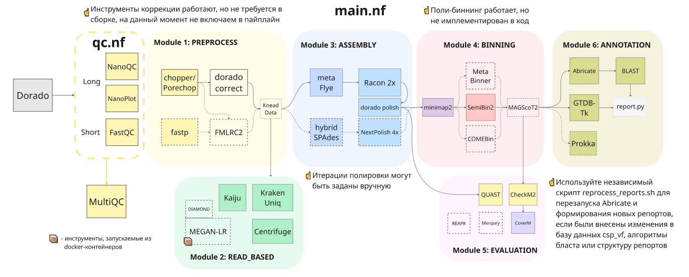

# hugDDT — Metagenomics Nextflow Pipeline
human gut Disease Diagnostics Tool :)

## Overview
A linearly-modular Nextflow-based pipeline designed for the processing and analysis of high-coverage metagenomic sequencing data generated from next-generation (NGS) and third-generation (TGS) sequencing platforms. The pipeline is primarily aimed at comprehensive microbiome profiling and the detection of virulence-associated genetic determinants relevant to human disease. The pipeline is oriented on the analysis of Nanopore (R10) and hybrid Nanopore+Illumina data of human gut microbiome communities.


## Modules
- **Preprocess**: Adapter trimming, quality filtering, read correction (ONT/Illumina)
- **Read_Based**: Taxonomic classification (KrakenUniq, Centrifuger, Kaiju)
- **Assembly**: Assembly and polishing (metaFlye/hybridSPAdes; Racon -> Dorado_polish -> NextPolish)
- **Binning**: Metagenome-assembled genomes (MAG) reconstruction using SemiBin2
- **Annotation**: Taxonomic annotation with GTDB-Tk, virulence-associated genes search by Abricate and BLAST
- **Evaluation**: Genome quality and abundance assessment (CheckM2, CoverM, metaQUAST)



## Profiles
> actually working and usable
- `hybrid`: Enables processing of short reads and hybrid assembly/correction
- `prokka`: Activates detailed functional annotation (computationally intensive)

> actually not working, but prepared to be
- `read_expand`: Framework for alternative read-based classifiers (MEGAN7, MetaMaps)
- `polybin`: Parallel multi-strategy binning (COMEBin, MetaBinner and SemiBin2) and refinement (MAGScoT2) 

> actually doesn't exist yet, but prepared to be
- `annotate_expand`: Enables extended annotation with eggNOG/KEGG/antismash
- `viral_search`: Additional viral genomes search and identifictaion

### Essential Run Parameters

> Note that parameters prefixed with "--" correspond to pipeline-specific configuration options defined in `nextflow.config`; single-dash options are native built-in Nextflow flags.

- `--input_ont`: Path to the directory containing Nanopore FASTQ files 
- `--input_short`: Path to the directory containing Illumina paired-end FASTQ files
- `--outdir`: Path to the output directory where all results would be published
- `-with-conda`: Mandatory flag enabling execution under multiple Conda environments
- `-resume`: Resumes a previously interrupted or extended analysis, e. g. after appending new samples to the already analyzed cohort

### Not That Essential Run Parameters
- `--databases`: Path to the databases directory (`/mnt/raid0/Databases/DDTdb` by default) 
- `-work-dir`: Path to the working directory where intermediate workflow data is saved to (`/mnt/raid0/Toxins/work_nf` by default)
- `--cpus`: Number of CPU cores allocated to the pipeline (250 by default)
- All other default parameters may be set in the `nextflow.config`

## How to Run the Pipeline

Before execution, install all required Conda environments and third-party tools using `ultimative_installer.sh` script and activate main environment by `conda activate pipe_develop`.
The pipeline can then be executed from any directory by the next commands sequence:
```bash
nextflow run <path to the main.nf script> \
  --input_ont <path to the long reads fastq files> \
  --outdir <path to the outdir> \
  -with-conda \
  --cpus <num of cpus to allocate>
```

#### Examples of the Pipeline Run
###### Simple run from the Pipeline Directory 
```bash
nextflow run main.nf \
  --input_ont path/to_the/data/ONT_fastq \
  --outdir results_20.12 \
  -with-conda
```

###### Simple run with additional parameters
```bash
nextflow run main.nf \
  --input_ont path/to_the/data/ONT_fastq \
  --outdir results_20.12 \
  -with-conda --cpus 128 \
  --chopper_opts '-q 9 -l 500 --maxlength 200000' 
```

###### Hybrid type of run
```bash
nextflow run main.nf \
  --input_ont path/to_the/data/ONT_fastq \
  --input_short /path/to_the/data/illumina \
  --outdir results_22.12 \
  --hybrid -with-conda --cpus 128 --racon_rounds 4
```

###### Complicated type of run (resumed, different workdir, different run directory)
```bash
nextflow run /mnt/raid0/Toxins/hugDDT/main.nf \
  --input_ont ~/path/to_the/data/ONT_fastq \
  --outdir somewhere/results_30.12 \
  -with-conda --prokka --polybin --cpus 258 \
  -work-dir path/to_the/different/place \
  -resume
```

##### QC Shortcut
Run QC before main pipeline if you want:
```bash
nextflow run qc.nf \
  --input_ont path/to_the/data/ONT_fastq \
  --input_short /path/to_the/data/illumina \
  --outdir reports/QC \
  -C qc.config 
```

## Output Directory Structure
- `annotation/{sample_id}`: Abricate and GTDB-Tk results
- `assembly/{sample_id}`: All assembly-related files, such as: flye contigs, every polisher output assembly, metaQUAST, CoverM and CheckM2 reports
- `binning/{sample_id}`: All MAGs (bins) fasta files (in `semibin2/output_bins` folder) and binnig metadata (contigs sorting, coverage and algorithmic scores) 
- `taxonomy/{sample_id}`: Taxonomical profiling results (from KrakenUniq, Centrifuge and Kaiju separately); one day there will be some *consensual* tax profile based on them
- `trimmed/{sample_id}`: Empty symbolic links to trimmed and filtered reads
- `reports/{sample_id}`: Main informative reports: virulence factors and genomes characteristics
- `export/{sample_id}`: Aggregated reports generated throughout the pipeline
- At pipeline completion, the output root directory contains execution reports: report_\*.html, timeline_\*.html and trace_*.txt 

## Final Reports
- `genomes_report.csv`: Summary of recovered MAGs, including taxonomy, completness and contamination, quantitative proportions, genome sizes, virulence factors per genome, etc.
- `virulence_list.csv`: Detailed list of all virulence factors found in the community, annotated by the bin taxonomy, local BLAST results and coverage/identity percentage
- `genome_cover.tsv`: CoverM results with Mean Coverage, Relative Abundance and Covered Fraction measures 
- `quality_report.tsv`: CheckM2 results with "specific" mode on 
- `report.html`: metaQUAST interactive report 
- Bunch of PNG files with binning and taxonomical analysis results visualisation 

## Auxiliary Scripts
final_reports.py, blast.py abd databinning.sh are used in the pipeline to process or generate data. The user might be interested only in two scripts:
- `scripts/reprocess_report.sh`: Used to rerun BLAST and Final Reports generation based on published data, with no need to rerun the pipeline. Checks for the abscent samples, already reprocessed and not calculted ones, but in progress. Needs one positional argument to locate the outdir:
```bash
bash scripts/reprocess_reports.sh /mnt/full/path/to/outdir
```
The reprocessed results would be stored in the `export/{sample_id}` folder in the same output directory. 
- `ultimative_installer.sh`: simple script to install all the conda environments and third-party tools, making the execution of the pipeline possible from under any user. **MAMBA BEING INSTALLED IS HIGHLY RECOMMENDED!**

## Help
To print help from the command line:
```bash
nextflow run main.nf --help

``` 
> Execution status and resource utilization can be monitored using standard system tools such as `top` or `htop`
